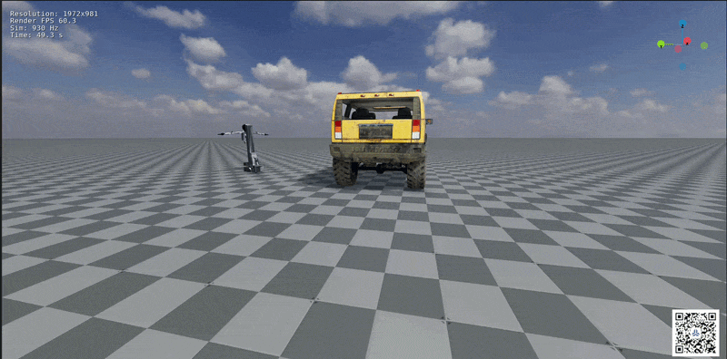
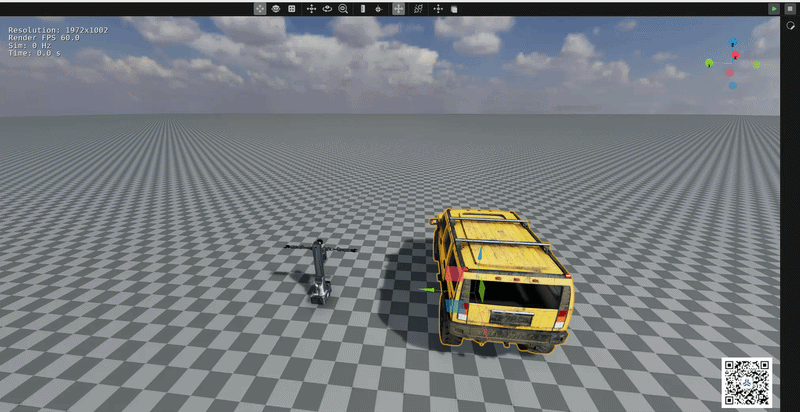

# ORCA 机器人仿真工作坊

当前 `release/26.7.1` 分支为**入门篇**：完成环境安装与资产准备，运行差速底盘和阿克曼车辆，选学 G1 人形机器人运控，为后续视觉导航与巡检开发做准备。

## 资料导航

| 资料 | 入口 | 内容 |
| --- | --- | --- |
| 技术方案 | [工作坊目标与实验安排](docs/tutorial.md#workshop-plan) | 学习目标、技术路线、实验内容与完成标准 |
| 完整教程 | [Tutorial](docs/tutorial.md) | 安装、界面操作、资产准备、三个 Demo 与 FAQ |
| 飞书详细文档 | [飞书文档](https://ucnj8k63v5wn.feishu.cn/wiki/TnwZwVptdi9r9MkmtSUc4OfCnzh?from=from_copylink) | 图文讲解与补充材料（推荐依照飞书文档进行学习，文档内有详细的视频教学） |
| Demo视频 | [视频或动图](#demo) | 运行效果 |
| 常见问题 | [FAQ 与排查顺序](docs/tutorial.md#faq) | 环境、资产、通信与控制问题 |
| 官方说明 | [OrcaPlayground 官方 README](https://github.com/openverse-orca/OrcaPlayground/blob/release/26.7.1/README.md) | 安装说明、完整示例目录与扩展开发 |

## 你将完成什么

- 配置 OrcaLab 与 Python 环境，理解 OrcaLab、OrcaGym 和控制程序的关系。
- 订阅资产，将 Asset 拖入场景形成 Actor，并保存为 Layout。
- 用 W/A/S/D 控制差速底盘和阿克曼车辆，对比两种转向方式。
- 选学运行 G1 已经训练好的运动策略。

## Demo 展示

以下为已有演示素材，供复现时对照。

### 01 · 差速轮式底盘

使用 W/A/S/D 控制前进、后退和转向，观察左右轮速度差如何改变行驶方向。

**[查看完整视频](docs/images/差速轮式底盘.webm)**

### 02 · 阿克曼车辆

控制黄色越野车前进、后退和转向，观察阿克曼车辆运动。

**[查看完整视频](docs/images/Ackerman底盘.webm)** 

### 03 · G1 人形机器人运控（选学）

加载已有 ONNX 运动策略，观察 G1 初始化、站立与行走。本实验只做策略推理，不重新训练模型。

## 遇到问题

先确认版本和 Python 环境，再检查项目目录、资产与 Layout、仿真状态、gRPC 连接，最后检查控制程序。完整步骤见 [FAQ](docs/tutorial.md#faq)。

| 现象 | 优先检查 |
| --- | --- |
| 看不到外部程序 | 是否从仓库根目录运行 `orcalab .`，是否存在 `.orcalab/config.toml` |
| 找不到机器人或执行器 | 资产是否正确、是否已拖入场景、是否只有一台匹配机器人 |
| W/A/S/D 无反应 | 仿真视口焦点、英文输入法、控制程序是否仍在运行 |
| 缺少 Python 模块 | 当前环境是否正确，是否安装基础及对应示例依赖 |

## 后续实战分支

| 分支 | 内容 |
| --- | --- |
| [release/26.7.1](https://github.com/Xbotics-Embodied-AI-club/Orcaplayground-G1-routing-inspection/tree/release/26.7.1) | 当前入门工作坊资料与基础示例 |
| [demo1-v1-factory-navi](https://github.com/Xbotics-Embodied-AI-club/Orcaplayground-G1-routing-inspection/tree/demo1-v1-factory-navi) | 工厂导航演示 |
| [feature/demo1-v1-green-table](https://github.com/Xbotics-Embodied-AI-club/Orcaplayground-G1-routing-inspection/tree/feature/demo1-v1-green-table) | 绿色桌子视觉避障演示 |

## 官方资料与致谢

本工作坊基于 OrcaPlayground 与 OrcaGym 开发。完整平台说明、更多示例和扩展开发方法请参考上游资料：

- [OrcaPlayground 官方 README（release/26.7.1）](https://github.com/openverse-orca/OrcaPlayground/blob/release/26.7.1/README.md)
- [OrcaGym](https://github.com/openverse-orca/OrcaGym)
- [ORCA 官方文档](https://docs.orca3d.cn/)
- [ORCA 资产中心](https://simassets.orca3d.cn/)

感谢上游项目及其贡献者。许可证见 [LICENSE](LICENSE)。
