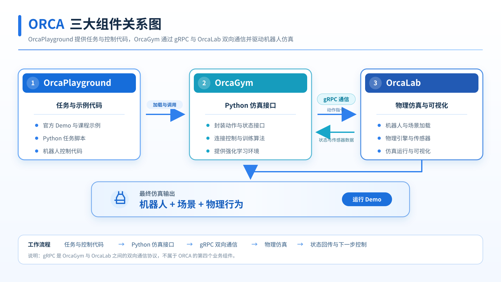
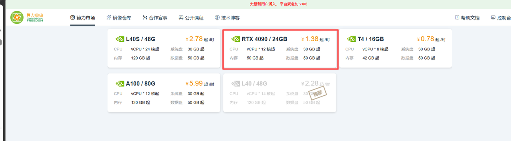
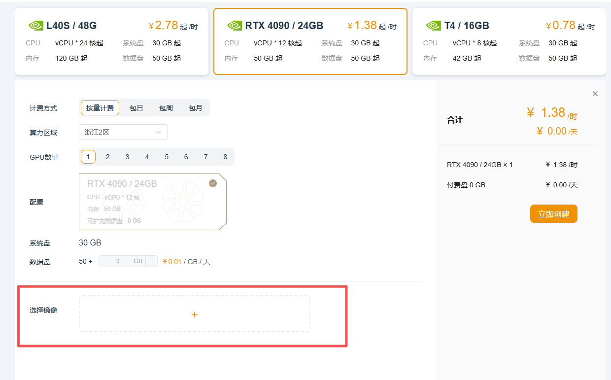
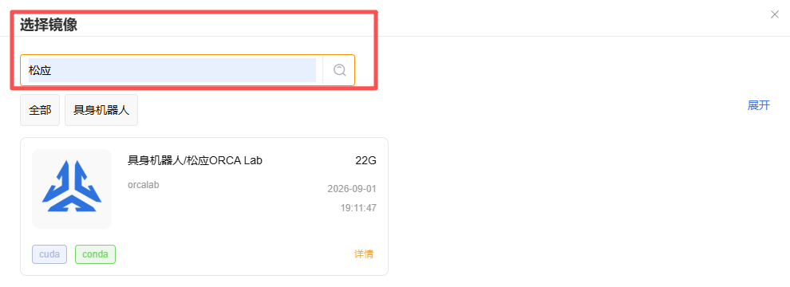
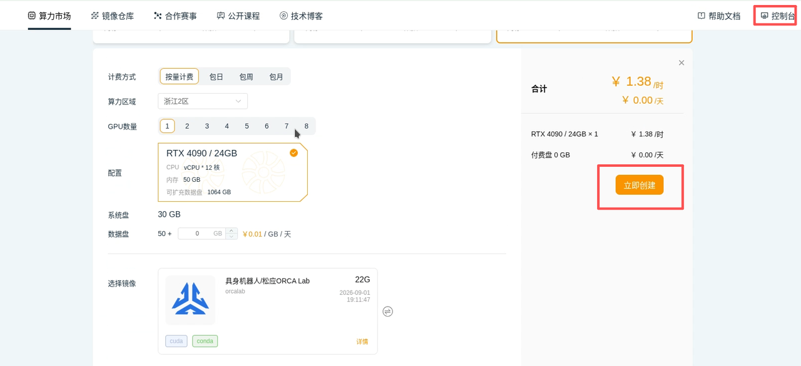

# ORCA 机器人仿真工作坊 · 技术方案与入门教程

> 工作坊入门篇，面向希望学习机器人仿真、强化学习和具身智能开发的同学。
> 建议具备基础的 Python 使用经验，以及 Linux 命令行操作能力。

---

<a id="workshop-plan"></a>

## 工作坊技术方案

### 课程目标与最终产出

学员使用现有示例完成从环境安装、资产订阅、场景搭建到 Python 控制的仿真流程，能够独立启动机器人、观察运动，并根据日志定位基础问题。

最终产出包括：已配置的运行环境，以及能够展示控制效果的录屏或运行记录。差速底盘为主实验，阿克曼车辆用于对比转向方式，G1 运控为选学实验。

### 技术路线

```text
OrcaLab 26.7.1 + Python 环境
    → 订阅资产、生成 Actor
    → Python Example 通过 OrcaGym / gRPC 连接仿真
    → 键盘输入或预训练策略生成控制指令
    → 执行器驱动机器人运动
```

### 实验安排与完成标准

| 环节 | 实验内容 | 学员完成标准 |
| --- | --- | --- |
| 环境准备 | 选择本地或云平台路线，检查版本并安装依赖 | OrcaLab 能启动，项目外部程序列表可见 |
| 场景搭建 | 订阅资产，区分 Asset / Actor / Layout | 能在场景大纲中找到目标 Actor，重新打开保存的 Layout |
| 差速底盘 | 启动示例，用 W/A/S/D 控制底盘 | 完成前进、后退与左右转向，终端无持续报错 |
| 阿克曼车辆 | 控制黄色越野车，对比差速与前轮转向 | 观察前轮转角和弧线行驶，能说明两种转向方式的区别 |
| G1 运控（选学） | 加载现有 ONNX 策略并运行自动行走 | 完成初始化、基本站立与策略行走，无持续连接或模型错误 |
| 排错与记录 | 使用 FAQ 按环境、场景、通信、控制顺序检查 | 能提供启动命令、版本、资产标识与完整日志 |

---

## 一、本篇学习目标

完成本篇学习后，你应该能够：

1. 独立完成 OrcaLab 的安装与启动；
2. 使用 ORCA 资产中心订阅机器人和场景资产；
3. 在 OrcaLab 中完成基本场景搭建；
4. 理解 **Asset、Actor、Layout** 三个核心概念；
5. 理解 OrcaLab、OrcaGym 与 Python 程序之间的基本关系；
6. 独立运行 OrcaPlayground 官方 Demo；
7. 使用键盘控制轮式机器人；
8. 根据终端日志初步排查资产、Actor 和通信端口问题。

> **本篇的重点**：先把 `环境 → 资产 → 场景 → Python → 仿真` 这一整条开发链路跑通。

---

## 二、认识 ORCA

### 2.1 松应科技与 ORCA 简介

#### 松应科技介绍


松应科技是一家专注于物理 AI 与机器人仿真训练的科技企业，围绕自主研发的 **ORCA OS 物理 AI 操作系统**，为机器人研发、训练、验证与产业应用提供统一技术底座。

公司面向企业研发与项目交付提供 ORCA Studio、ORCA 物理 AI 一体机、场景与数据服务及行业项目建设；同时通过 **ORCA Lab** 服务高校师生、个人开发者与创新团队。

#### ORCA 简介


ORCA 平台将机器人开发过程组织成一个完整的仿真训练闭环：

1. 开发者首先明确**任务目标和评价指标**；
2. 在 **OrcaLab** 中构建机器人资产与仿真场景，并配置关节、执行器、碰撞体以及各种仿真传感器；
3. **物理引擎**负责计算机器人在重力、摩擦、碰撞和接触环境下的运动状态，同时生成图像、深度、激光雷达、IMU、关节状态和力反馈等观测数据；
4. **OrcaGym** 通过 **gRPC** 与 OrcaLab 建立通信，将仿真状态传递给 Python 控制程序或训练算法；
5. 算法根据观测数据计算动作指令，并将运动控制结果发送回仿真环境，使机器人完成移动、导航、抓取和避障等任务；
6. 系统持续记录任务成功率、累计奖励、运动稳定性、碰撞次数和执行时间等指标，并根据评估结果不断调整机器人模型、场景参数、物理参数和算法策略。

最终形成 **"建模—仿真—感知—决策—执行—评估—优化"** 的迭代开发流程。

可以用一条流水线理解 ORCA：

```
机器人资产
    ↓
场景搭建
    ↓
物理仿真
    ↓
传感器数据
    ↓
Python / 控制算法
    ↓
机器人行为
```

### 2.2 ORCA 的三个核心组件

| 组件 | 作用 |
|---|---|
| **OrcaLab** | 负责仿真（物理引擎、场景、资产、传感器） |
| **OrcaGym** | 负责通过 gRPC 连接 OrcaLab 与 Python 程序 |
| **Python Example** | 负责控制算法 / 训练策略，计算动作指令 |

> **本训练营主要接触的就是以上三个组件。**

这里只解释一次，后面的章节不再重复介绍三者的定义。

### 2.3 本篇使用的软件版本

| 组件 | 版本 |
|---|---|
| Python | 3.12 |
| OrcaLab | 26.7.1 |
| OrcaGym | 26.7.1 |
| OrcaPlayground | release/26.7.1 |

### 2.4 ORCA 的完整运行关系

```
机器人资产和场景
        ↓
  OrcaLab 执行物理仿真
        ↕ gRPC
OrcaGym 交换观测和动作
        ↕
Python Example 计算控制指令
```

**简单理解：**

- OrcaLab 负责仿真；
- Python Example 负责控制；
- OrcaGym 负责连接二者；
- 三者通过 **localhost:50051** 通信。


<center>图 2-1：ORCA 三个核心组件及完整工作流</center>

**官方入口：**

- 松应科技介绍：https://www.orca3d.cn/about/
- ORCA 产品主页：https://www.orca3d.cn/products/
- ORCA Lab 下载：https://www.orca3d.cn/developer/
- ORCA 文档：https://docs.orca3d.cn/
- OrcaGym：https://github.com/openverse-orca/OrcaGym
- OrcaPlayground：https://github.com/openverse-orca/OrcaPlayground

---


<a id="setup"></a>

## 三、准备开发环境

本篇命令使用 `orcalab` 作为 Conda 环境名；如果已有配置完成的 `orca` 环境或云镜像环境，激活实际环境即可，无需重复创建。OrcaLab 与 Python 示例应使用同一环境。

> 本章同时保留**云平台路线**和**本地 Ubuntu 路线**，但两条路线最终汇合到同一套 ORCA 环境。

### 3.1 选择运行方式与硬件设备建议

#### 3.1.1 两种运行方式

| 方式 | 说明 |
|---|---|
| 本地 Ubuntu | 自行安装 Miniconda，创建 `orcalab` 环境，再安装 OrcaLab 和 OrcaPlayground |
| 云平台镜像 | 镜像已预装 Ubuntu、Conda、OrcaLab 和 OrcaGym，只需检查版本并下载 OrcaPlayground |

> 两种方式只需要选择一种，不需要同时配置。后续 OrcaLab 和 Demo 的操作基本相同。

#### 3.1.2 硬件设备建议

| 硬件 | 课程建议 |
|---|---|
| CPU | 8 - 16 核 |
| 内存 | 64 GB（推荐） |
| 显存 | 运行Demo建议12GB以上；完整训练推荐24GB |
| 推荐显卡 | RTX 4090 24GB 或同等级显卡 |
| 系统盘 | 1TB NVMe SSD |
| 可用空间 | 建议预留 300GB |
| 网络 | 稳定宽带，用于下载软件、代码和资产 |

> RTX 4090 24GB 服务器可以完成本训练营后续 Demo、策略运行和训练流程。仅复现基础 Demo 时，可以适当降低硬件配置。

#### 3.1.3 操作系统说明

课程正文只使用：**Ubuntu / Linux**

> Windows 用户请参考 ORCA 官方 Windows 安装指南；为了保证命令和截图一致，本训练营统一使用 Ubuntu 环境进行演示。

官方教程：https://docs.orca3d.cn/#/%E7%8E%AF%E5%A2%83%E5%87%86%E5%A4%87/Windows%E7%B3%BB%E7%BB%9F%E5%AE%89%E8%A3%85OrcaLab%E6%8C%87%E5%8D%97_v1.0

---


### 3.2 路线一：使用本地 Ubuntu

#### 3.2.1 检查 Ubuntu 系统

```bash
lsb_release -a
```

> 只需确认当前使用的是 ORCA 官方支持的 Ubuntu 版本。

#### 3.2.2 检查 NVIDIA 显卡与驱动

```bash
nvidia-smi
```

> 能够正常显示显卡和驱动信息即可。如果命令失败，请先按照 NVIDIA 或 ORCA 官方文档完成驱动安装，再继续课程。

#### 3.2.3 安装基础工具

```bash
sudo apt update
sudo apt install -y git wget curl build-essential
```

> 具体缺少的 OrcaLab 图形依赖，以 ORCA 官方 Ubuntu 安装指南为准。

官方安装指南：https://docs.orca3d.cn/#/%E7%8E%AF%E5%A2%83%E5%87%86%E5%A4%87/Ubuntu%E7%B3%BB%E7%BB%9F%E5%AE%89%E8%A3%85OrcaLab%E6%8C%87%E5%8D%97_v1.0

---

### 3.3 路线二：使用云平台

> 以下以**自由算力平台**为例。

1. 打开平台：https://www.gpufree.cn/console/instances?status=3
2. 注册并登录账号，点击**算力市场**选择 GPU 型号（推荐 4090，售完可换其他 GPU）；
3. 选择镜像 → 点击**立即创建**；
4. 在操控台查看镜像实例。




> **注意：**
> 1. 云服务器镜像已安装 OrcaLab，但 **OrcaPlayground 未安装**，需要学员自行下载；
> 2. 使用云环境时，需关闭本机浏览器设置里的"启动鼠标手势"，否则仿真界面中右键拖动会卡死鼠标焦点位置。

#### 3.3.1 ~ 3.3.3 云平台环境检查

云平台镜像已预装 Ubuntu、Conda、OrcaLab 和 OrcaGym，因此**无需重复安装**，只需检查版本：

```bash
lsb_release -a
nvidia-smi
```

只需要确认当前使用的是ORCA官方支持的Ubuntu版本即可，同时确保能够正常显示显卡和驱动信息。如果命令失败，请重新按照NVIDIA或ORCA官方文档完成驱动安装。

```bash
sudo apt update
sudo apt install -y git wget curl build-essential
```
具体缺少的Orcalab图形依赖，以ORCA官方Ubuntu安装指南为准。

官方安装指南：https://docs.orca3d.cn/#/%E7%8E%AF%E5%A2%83%E5%87%86%E5%A4%87/Ubuntu%E7%B3%BB%E7%BB%9F%E5%AE%89%E8%A3%85OrcaLab%E6%8C%87%E5%8D%97_v1.0


---

### 3.4 安装课程软件

本课程提供两种运行方式：

- **本地 Ubuntu**：安装 Miniconda → 创建 `orcalab` 环境 → 安装 OrcaLab / OrcaGym / OrcaPlayground
- **云平台镜像**：已预装，只需检查版本并下载 OrcaPlayground

两种方式最终都使用以下版本：

```bash
Python 3.12
OrcaLab 26.7.1
OrcaGym 26.7.1
OrcaPlayground release/26.7.1
```

#### 3.4.1 云平台镜像

打开云平台终端，检查软件版本：

```bash
python --version
python -m pip show orca-lab orca-gym
```

检查完成后，直接进入 [3.4.4 下载课程仓库](#344-下载课程仓库) 下载 OrcaPlayground。

#### 3.4.2 本地 Ubuntu：安装 Miniconda

```bash
cd ~

wget https://repo.anaconda.com/miniconda/Miniconda3-latest-Linux-x86_64.sh

bash Miniconda3-latest-Linux-x86_64.sh
```

安装过程：

1. 按 Enter 阅读安装说明；
2. 输入 `yes` 接受许可协议；
3. 使用默认安装位置；
4. 初始化 Conda 时输入 `yes`。

安装结束后关闭并重新打开终端，检查：

```bash
conda --version
```

若仍提示 `conda: command not found`：

```bash
source ~/.bashrc
conda --version
```

#### 3.4.3 本地 Ubuntu：创建课程环境并安装 OrcaLab

```bash
conda create -n orcalab python=3.12 -y
conda activate orcalab
```

> 激活成功后，终端提示符前会出现 `(orcalab)`。

```bash
python -m pip install --upgrade pip
python -m pip install "orca-lab==26.7.1"
```

> OrcaGym 作为 OrcaLab 依赖一并安装，无需单独下载。

检查：

```bash
python --version
python -m pip show orca-lab orca-gym
```

每次打开新终端后，本地用户需先执行：`conda activate orcalab`

<a id="download-repo"></a>

#### 3.4.4 下载课程仓库

使用社区仓库的 `release/26.7.1` 分支，获取本篇资料和示例代码。为与后续命令一致，本地目录统一命名为 `OrcaPlayground`：

```bash
mkdir -p ~/ORCA
cd ~/ORCA
git clone --branch release/26.7.1 --single-branch \
  https://github.com/Xbotics-Embodied-AI-club/Orcaplayground-G1-routing-inspection.git OrcaPlayground
cd ~/ORCA/OrcaPlayground
```

若本地已有仓库，请先确认当前分支为 `release/26.7.1`，无需重复克隆。上游的完整说明见 [OrcaPlayground 官方 README](https://github.com/openverse-orca/OrcaPlayground/blob/release/26.7.1/README.md)。

#### 3.4.5 安装 OrcaPlayground 基础依赖

确认当前终端已经进入课程使用的 Python 环境，并位于 OrcaPlayground 根目录：

```bash
cd ~/ORCA/OrcaPlayground
conda activate orcalab
python -m pip install -r requirements.txt
```

> 这里只安装第一篇课程和基础示例需要的公共依赖。后续 Demo 的额外依赖在对应章节单独安装。

---

## 四、启动 OrcaLab 并认识基本界面

### 4.1 启动 OrcaLab

```bash
conda activate orcalab
cd ~/ORCA/OrcaPlayground
orcalab
```

> 第一次启动会下载并初始化运行组件，请等待完成。若提示重新运行，关闭后再次执行 `orcalab` 即可。

### 4.2 切换中文界面

在顶部菜单依次选择：

```
编辑 → 配置 → 界面语言 → 简体中文
```

保存设置并重启 OrcaLab。部分机器人名称、资产名称和程序标识仍为英文，属正常现象。

### 4.3 认识四个主要区域

OrcaLab 界面主要分为四个区域：


<center>图 4-1：ORCALab中文主界面及四个主要区域</center>


| 区域 | 作用 |
|---|---|
| **资产面板** | 从资产中心添加机器人/场景资产 |
| **仿真视口** | 显示 3D 仿真场景 |
| **场景大纲** | 显示场景中已添加的 Actor 对象 |
| **属性面板** | 选中对象后查看属性信息 |

```text
从资产面板添加资产
        ↓
资产出现在仿真视口中
        ↓
场景大纲中出现对应对象
        ↓
选中对象后，在属性面板中查看信息
```

### 4.4 选择仿真程序

点击右上角**"启动仿真"**按钮，打开"选择仿真程序"窗口：


<center>图 4-2 OrcaLab"选择仿真程序"</center>

| 方式 | 说明 |
|---|---|
| **从 OrcaLab 界面启动** | 在仿真程序列表中选择程序后点击"启动"（推荐） |
| **从 Ubuntu 终端启动** | 选择"无仿真程序（手动启动）"，再在终端运行 Python 程序 |

不同版本和项目配置中程序名称可能略有不同：

| 程序名 | 说明 |
|---|---|
| `run_wheeled_chassis` | 差速轮式底盘 |
| `run_ackerman` | 阿克曼车辆 |
| `run_g1` | G1 人形机器人 |

---

<a id="assets"></a>

## 五、订阅资产并搭建场景

```text
订阅资产包 → 等待资产同步 → 找到目标 Asset → 将 Asset 加入场景
→ 确认场景中的 Actor → 保存 Layout
```

### 5.1 订阅 OrcaPlaygroundAssets

在 OrcaLab 下方找到**"资产"**面板 → 点击**"打开资产中心"**：

1. 登录 ORCA 账号；
2. 搜索 `OrcaPlaygroundAssets`；
3. 找到对应资产包后点击**订阅**；
4. 等待资产同步完成。

> **区分两个名称：**
> - **OrcaPlaygroundAssets**：资产中心订阅的资产包（包级）
> - 具体机器人/车辆 Asset：资产包内部的资源（类级）

**判断资产是否准备完成：**

```text
关键不是"已点击订阅"，而是资产状态显示为 Up to Date
```


资产同步过程中保持网络稳定。同步完成后如资产面板未出现新增资源，可刷新资产列表或重启 OrcaLab。

### 5.2 Asset、Actor 和 Layout

| 概念 | 说明 |
|---|---|
| **Asset** | 可重复使用的资源模板 |
| **Actor** | 将 Asset 拖入场景后生成的场景中的具体对象 |
| **Layout** | 多个 Actor 和环境配置组成的完整仿真场景 |

```text
Asset（资源模板）
        ↓
    拖入场景
        ↓
Actor（场景中的具体对象）
        ↓
   多个 Actor + 环境配置
        ↓
    Layout（完整仿真场景）
```


<center>图 5-2 Asset、Actor和Layout的基本关系</center>

> 一句话记忆：**Asset 是资源模板，Actor 是放入场景后的具体对象，Layout 是保存这些对象的完整场景。**
>
> Actor 不只表示机器人。车辆、桌子、货架、灯光、相机和障碍物等场景对象也可以是 Actor。

### 5.3 将资产加入场景

1. 在资产面板中搜索目标 Asset 的准确名称；
2. 将 Asset **拖入仿真视口**；
3. 场景中生成对应 Actor；
4. 在场景大纲中确认 Actor；
5. 保存当前 Layout。

```text
资产面板中的 Asset（黄色越野车）
        ↓
   属于可重复使用的模板
        ↓
   拖入仿真视口
        ↓
   场景中生成一台具体车辆（Actor）
        ↓
   场景大纲中出现对应 Actor 名称
```


<center>图5-3 从Asset到Actor的Orcalab界面对应关系</center>

> 后续 Python 程序控制的是场景中的**具体 Actor**，而非资产面板中的 Asset 模板。

---

<a id="demo-differential"></a>

## 六、Demo 1：差速轮式底盘

> 这是第一篇的主 Demo，也是必须完成的内容。

### 6.1 Demo 目标

-  将差速轮式底盘加入场景；
-  启动官方控制程序；
-  使用 W/A/S/D 控制机器人；
-  完成从 Python 程序到 OrcaLab 仿真的机器人控制闭环。

### 6.2 准备机器人资产

搜索并拖入以下 Asset：

```
openloong_gripper_2f85_mobile_base_usda
```

确保场景大纲中已生成对应的机器人 Actor，建议 Layout 中只保留一台匹配的差速轮式底盘。

### 6.3 启动程序

在 OrcaLab 中点击**"启动仿真"** → 选择 `run_wheeled_chassis` → 点击**启动**。


如需查看完整 Python 报错，可选择"无仿真程序（手动启动）"，在 OrcaPlayground 根目录执行：

```bash
python -m examples.wheeled_chassis.run_wheeled_chassis
```

> 界面启动和终端启动二选一，不要重复运行。

### 6.4 键盘控制

程序启动后，**先单击一次 OrcaLab 仿真视口**，使键盘输入作用于当前场景。
| 按键 | 机器人动作 |
|---|---|
| W | 前进 |
| S | 后退 |
| A | 左转 |
| D | 右转 |

建议依次测试前进、后退、左转和右转。

### 6.5 运行成功的现象

确认以下三点：

-  程序运行过程中没有持续报错；
-  机器人能够响应 W/A/S/D；
-  差速底盘能够完成前进、后退和转向。

### 6.6 运行效果
[查看完整视频：差速轮式底盘（WebM）](images/差速轮式底盘.webm)。下方为运行预览：


>视频中需要重点观察移动协作机器人的运动。画面中的黄色越野车不是本 Demo 的控制对象；学员正式复现时，仍建议使用只包含一台目标底盘的独立 Layout。

从键盘输入到机器人运动的过程可以概括为下图所示。


本篇只需要理解：键盘输入经过 Python、OrcaGym 和 gRPC 传递给 OrcaLab，最终驱动机器人运动。具体接口和控制算法将在后续课程中继续介绍。

---

<a id="demo-ackerman"></a>

## 七、Demo 2：阿克曼车辆

> 继续使用相同的 OrcaLab 和 Python 环境。

### 7.1 差速底盘与阿克曼车辆的区别

| 对比项 | 差速轮式底盘 | 阿克曼车辆 |
|---|---|---|
| 转向方式 | 通过左右轮速度差转向 | 通过转向轮角度转向 |
| 转弯特点 | 可以实现较小半径转向 | 通常沿一定半径的弧线转向 |
| 常见应用 | AGV、仓储机器人、服务机器人 | 汽车、无人车、室外巡检车辆 |

> 同样是"左转"，不同的机械结构会产生不同的执行器动作。

> **名称说明：** 英文写作 Ackermann Steering；ORCA 26.7.1 中脚本使用 `Ackerman`，如 `run_ackerman`。运行程序时必须使用实际拼写。

### 7.2 准备车辆资产

搜索并拖入：

```
hummer_h2_usda
```

中文界面中资产名称显示为：**黄色越野车**

Demo中的名称对应关系如下：
| 名称类型 | 内容 |
|---|---|
| 资产包 | OrcaPlaygroundAssets |
| 资产标识 | hummer_h2_usda |
| 中文显示名 | 黄色越野车 |


<center>图7-1 在资产面板中搜索阿克曼车辆</center>

### 7.3 启动程序

选择 `run_ackerman`（阿克曼车辆）→ 点击**启动**。

从终端查看完整日志：

```bash
python -m examples.wheeled_chassis.run_ackerman
```

默认连接地址：`localhost:50051`

### 7.4 键盘控制

| 按键 | 操作 |
|---|---|
| W / S | 前进 / 后退 |
| A / D | 前轮左转 / 右转 |

操作时重点观察：

- 按下 W 或 S，车辆是否可以前进或后退；
- 按下 A 或 D，前轮方向是否发生变化；
- 转向时，车辆是否沿弧线行驶。
- 车辆能够正常前进、后退和转向。

### 7.5 运行效果
[查看完整视频：阿克曼车辆（WebM）](images/Ackerman底盘.webm)。下方为运行预览：


视频中同时保留了差速轮式底盘，用于直观对比两种车辆的运动方式。学员正式复现时，仍建议将两个 Demo 分别保存在独立 Layout 中。

---

<a id="demo-g1"></a>

## 八、Demo 3：G1 官方运控示例【选学】

> 本章为选学内容，使用官方已有运动策略，不进行模型训练。暂时跳过不影响第一篇主线。

### 8.1 安装额外依赖

进入 OrcaPlayground 根目录，激活课程环境并安装 G1 示例依赖：

```bash
cd ~/ORCA/OrcaPlayground
conda activate orcalab

python -m pip install -r examples/g1/requirements.txt
```

### 8.2 准备 G1 资产

搜索并拖入：

```
g1_29dof_old_usda
```


### 8.3 运行官方示例

选择"无仿真程序（手动启动）"，在新终端中执行：

```bash
cd ~/ORCA/OrcaPlayground
conda activate orcalab

python -m examples.g1.run_g1_random_walk
```

> 本过程只进行模型推理，不会重新训练模型。


<center>图8-2 G1官方运动策略运行效果</center>

如需手动控制，可在结束当前程序后，于 OrcaLab 程序列表中选择 `run_g1`。两种方式选其一。

### 8.4 运行成功的现象

- G1 能够完成初始化并保持基本站立；
- G1 能够按照已有运动策略行走；
- 终端没有持续出现连接失败或模型加载错误。

---

<a id="faq"></a>

## 九、FAQ

> 运行 Demo 时遇到问题时，**不要一开始就改 Python 代码，也不要立即重装环境**。按以下链路定位问题所在层级，一次只处理一个问题：

```text
版本与 Python 环境
        ↓
OrcaPlayground 项目目录与配置
        ↓
资产、Actor 与 Layout
        ↓
OrcaLab 仿真状态
        ↓
gRPC 通信
        ↓
Python Example 与控制输入
```

### 9.1 排查前先确认基础信息

统一环境：

| 项目 | 值 |
|---|---|
| OrcaLab 版本 | 26.7.1 |
| OrcaPlayground 分支 | release/26.7.1 |
| 操作系统 | Ubuntu / Linux |
| Conda 环境 | `orcalab` |

进入 OrcaPlayground 根目录并激活环境：

```bash
cd ~/ORCA/OrcaPlayground
conda activate orcalab

pwd
which python
python --version
git branch --show-current
```

### 9.2 问题一：OrcaLab 可以启动，但看不到外部程序

**原因：** OrcaLab 未从 OrcaPlayground 根目录启动，未读取当前项目的配置文件。

**检查步骤：**

```bash
pwd
ls -l .orcalab/config.toml
```

从项目根目录重新启动：

```bash
conda activate orcalab
orcalab .
```

> `.` 表示以当前目录作为 OrcaLab 工作目录，从中读取 `.orcalab/config.toml`。

### 9.3 问题二：资产面板找不到 Demo 所需资产

按顺序检查：

1. 是否已登录正确的 ORCA 账号；
2. 是否已在资产中心订阅对应资产包；
3. `OrcaPlaygroundAssets` 是否已同步完成；
4. 是否在正确的资产分类中搜索；
5. 是否使用了教程给出的准确资源标识；
6. 资产同步状态是否仍为 `Pending Download`。

> 资产中心的逻辑路径不等于 Linux 本地文件路径。不要因为本地找不到同名文件夹就判断资产未安装。

**排查顺序：**

```text
确认账号登录状态 → 重新打开资产中心 → 等待资产包同步完成
→ 重新启动 OrcaLab → 使用准确资源标识再次搜索
```

### 9.4 问题三：Python 程序无法连接 OrcaLab

终端出现连接失败 / 无法连接 `localhost:50051` 时，依次检查：

1. OrcaLab 是否已正常启动；
2. OrcaLab 主界面是否已完成加载；
3. 正确的 Layout 是否已打开；
4. 仿真服务是否已启动；
5. Python Example 与 OrcaLab 是否运行在同一台计算机；
6. 是否重复启动了同一个控制程序。

> 通信地址默认为 `localhost:50051`。检查端口：

```bash
ss -lnt | grep 50051
```

> **不要重复启动程序：** 从 OrcaLab 外部程序列表启动时，不要再从终端重复运行同一个程序。

### 9.5 问题四：运行 Example 时提示缺少 Python 依赖

常见报错：`ModuleNotFoundError` / `ImportError` / `No module named ...`

```bash
conda activate orcalab
cd ~/ORCA/OrcaPlayground

python -m pip install -r examples/<示例目录>/requirements.txt
```

例如安装 G1 依赖：

```bash
python -m pip install -r examples/g1/requirements.txt
```

> 使用 `python -m pip` 而非 `pip`，确保依赖安装到当前激活的 Python 环境中。

### 9.7 问题五：程序已运行，但键盘控制没有反应

按顺序检查：

1. 终端是否显示控制程序启动提示；
2. OrcaLab 仿真是否处于运行状态；
3. 是否已单击仿真视口获得输入焦点；
4. 输入法是否已切换为英文；
5. 是否使用了 W、A、S、D 按键；
6. 控制程序是否因报错已退出；
7. 当前 Layout 中是否存在正确的机器人 Actor。

**重新操作顺序：**

```text
确认 Python 程序仍在运行 → 确认 OrcaLab 仿真已启动
→ 单击仿真视口 → 切换为英文输入法 → 再次按下 W/A/S/D
```
